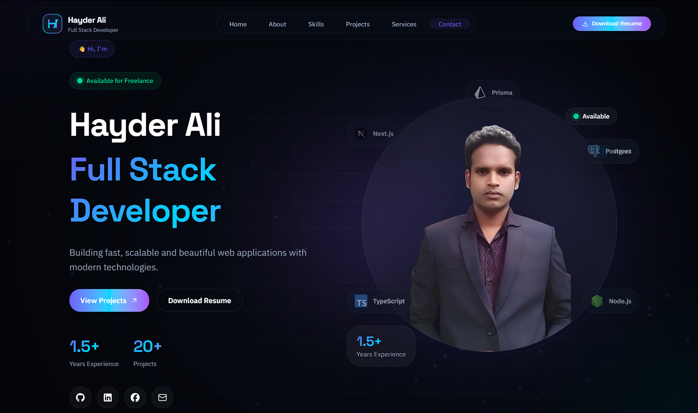

# 🚀 Hayder Ali - Full Stack Developer Portfolio

<p align="center">
  
</p>

<p align="center">
  A modern, responsive and interactive developer portfolio built with Next.js, TypeScript, Tailwind CSS and modern UI technologies.
</p>


<p align="center">

<a href="https://github.com/Hayder987">
GitHub
</a>
&nbsp; • &nbsp;

<a href="https://www.linkedin.com/in/hayder-ali-bb9175349">
LinkedIn
</a>
&nbsp; • &nbsp;

<a href="mailto:hayderbd4290@gmail.com">
Email
</a>

</p>

---
## 🌐 Live Demo

[](https://hayder4290.vercel.app)


---

## ✨ About The Project

This is my personal developer portfolio website where I showcase my skills, projects, services and development journey.

The goal of this portfolio is to present my full-stack development expertise with a modern, premium and user-focused design experience.

The website focuses on:

- Clean UI/UX
- Responsive design
- Smooth animations
- Modern development practices
- Performance optimization


---

# 🌟 Features

## 🎨 Modern UI

- Premium glassmorphism design
- Responsive layout for all devices
- Dark/light theme support
- Modern typography
- Smooth transitions


## ⚡ Animations

- Framer Motion animations
- Scroll reveal effects
- Animated sections
- Hover interactions
- Floating effects


## 🧑‍💻 Portfolio Sections

- Hero Section
- About Section
- Skills Section
- Featured Projects
- Services
- Development Process
- Contact Section
- Premium Footer


## 🚀 Performance

- Next.js App Router
- Optimized components
- Clean component architecture
- SEO friendly structure


---

# 🛠️ Tech Stack


## Frontend

- Next.js 16
- React 19
- TypeScript
- Tailwind CSS v4
- shadcn/ui
- Framer Motion


## UI & Animation

- Base UI
- Lucide React
- React Icons
- React Fast Marquee
- Lenis Smooth Scroll


## Development Tools

- ESLint
- pnpm
- Git
- GitHub


---

# 📂 Project Structure

nextjs-portfolio

---

│
├── app
│ ├── layout.tsx
│ ├── page.tsx
│ └── globals.css
│
├── components
│
│ ├── animations
│ │ ├── use-mouse-parallax.ts
│ │ └── animated-border.tsx
│ │
│ ├── common
│ │
│ ├── contact
│ │
│ ├── effects
│ │
│ ├── footer
│ │
│ ├── hero
│ │
│ ├── navbar
│ │
│ ├── process
│ │ ├── process-card.tsx
│ │ └── development-process.tsx
│ │
│ ├── projects
│ │
│ ├── providers
│ │
│ ├── sections
│ │
│ └── ui
│
├── config
│ ├── navigation.ts
│ ├── projects.ts
│ ├── services.ts
│ └── process.ts
│
├── lib
│ └── utils.ts
│
├── public
│
├── package.json
├── pnpm-lock.yaml
├── next.config.ts
└── tsconfig.json


---

# 📦 Installation


Clone the repository:

```bash
git clone https://github.com/Hayder987/nextjs-portfolio.git

cd nextjs-portfolio

pnpm install

pnpm dev

http://localhost:3000


📱 Responsive Design

The portfolio is optimized for:

✅ Desktop

✅ Laptop

✅ Tablet

✅ Mobile

Discovery

↓

Planning

↓

UI Design

↓

Development

↓

Testing

↓

Deployment


🔗 Connect With Me

GitHub:

https://github.com/Hayder987

LinkedIn:

https://www.linkedin.com/in/hayder-ali-bb9175349

Email:

hayderbd4290@gmail.com
